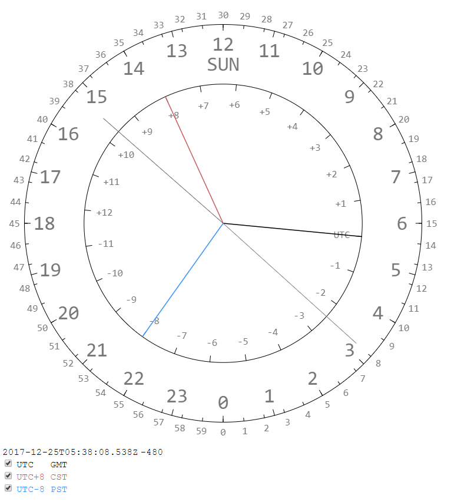

# Universal Clock

The clock simulates the rotation of earth, looked upon the north pole. The SUN shines on the top of the clock. 
Inner circle is time zone. Outer circle is time. You simply match inner circle's tick to outer circle to get the hour.

Bonus! It's also a compass. The hour hand matching your time zone is always pointing South.

